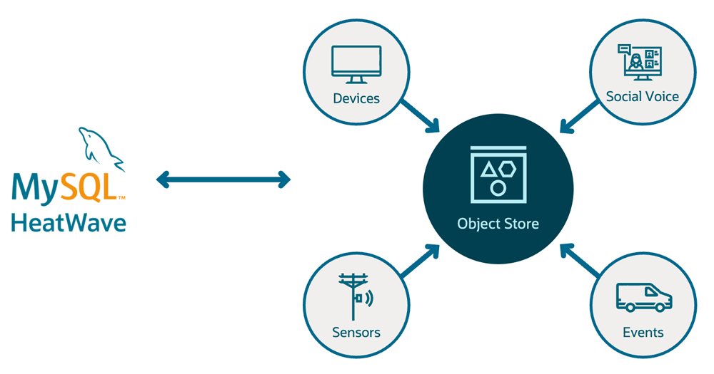

# Introduction

## About this Workshop

MySQL HeatWave is a fully managed database service powered by the HeatWave in-memory query accelerator. It’s the only cloud service that combines transactions, real-time analytics across data warehouses and data lakes, and machine learning in one MySQL Database—without the complexity, latency, risks, and cost of ETL duplication. It’s available on OCI, AWS, and Azure.

MySQL HeatWave includes MySQL HeatWave Lakehouse, letting users query hundreds of terabytes of data in object storage—in a variety of file formats, such as CSV, Parquet, and Aurora/Redshift export files from other databases. Customers can query transactional data in MySQL databases, data in various formats in object storage, or a combination of both using standard MySQL commands. Querying data in object storage is as fast as querying data inside the database.

To best understand the capabilities and ease of use of our managed service, we
will walk you through a deployment scenario that is uniquely possible with MySQL
HeatWave Lakehouse. The deployment goals are:

1. Walk you through the steps needed to load data from Object Storage to MySQL HeatWave.
2. Show how MySQL HeatWave Lakehouse enables you to perform analytics on top of your object storage data without having to move data into the MySQL database.
3. Show how to run queries on data coming from MySQL InnoDB storage loaded into HeatWave and data loaded from object storage into HeatWave all using standard MySQL syntax and familiar querying commands.

_Estimated Time:
- Labs 1 through 8  : 1.5 hours
- With (Bonus) Labs 1 through 12 : 3 hours
### About Product/Technology

MySQL HeatWave enables users to process and query hundreds of terabytes of data in object storage—in a variety of file formats, such as CSV, Parquet, and Aurora/Redshift export files. The data remains in the object store and customers can query and analyse it with standard SQL syntax. With this capability, MySQL HeatWave provides one service for transaction processing, analytics across data warehouses and data lakes, and machine learning—without the need for complex ETL across cloud services.

MySQL HeatWave Lakehouse is 17X faster than Snowflake and 6X faster than Amazon Redshift. Loading data into MySQL HeatWave Lakehouse is also significantly faster.

#### MySQL HeatWave Lakehouse, lets users process and query hundreds of terabytes of data in the object store

  

### Objectives

In this HOL Workshop, you will use OCI and HeatWave Services to help Fictitious Corp Eureka improve its Customer Satisfaction by completing the following labs in a Development Environment:

1. Create a MySQL HeatWave Database System
2. Create a Bastion and Linux Apache MySQL PHP (LAMP) Server
3. Add a HeatWave Cluster to the Database System
4. Upload CSV and Parquet files data into an OCI Object Storage Bucket
5. Load MySQL Database data into the HeatWave Cluster and Run Query comparisons
6. Automatically Load CSV format data directly from OCI Object Store to Lakehouse
7. Manually Load Parquet format data directly from the Object Store
8. Analyze Lakehouse  data from the Orders, Stores, Delivery\_orders, and Delivery\_vendors tables to identify new features for the e-commerce application
9. Create and Run MySQL HeatWave and Lakehouse Applications on LAMP Server.
10. Review how  Customer Satisfaction is achieved with the New "Select Delivery Location" feature in the e-commerce application "Purchase Page ".
11. Create an Oracle Analytics Cloud instance and Build a real-time dashboard
12. Develop MySQL HeatWave Low Code Application with Oracle APEX
13. Stop OCI Services

### Prerequisites

- An Oracle Free Tier, Paid or LiveLabs Cloud Account
- Some Experience with MySQL Shell - [MySQL Site](https://dev.MySQL.com/doc/MySQL-shell/8.0/en/).

You may now **proceed to the next lab**

## Acknowledgements

- **Author** - Perside Foster, MySQL Solution Engineering

- **Contributors** - Abhinav Agarwal, Senior Principal Product Manager, Nick Mader, MySQL Global Channel Enablement & Strategy Manager
- **Last Updated By/Date** - Perside Foster, MySQL Solution Engineering, September 2023
