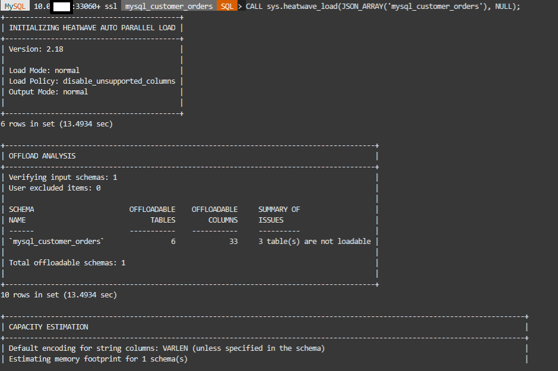
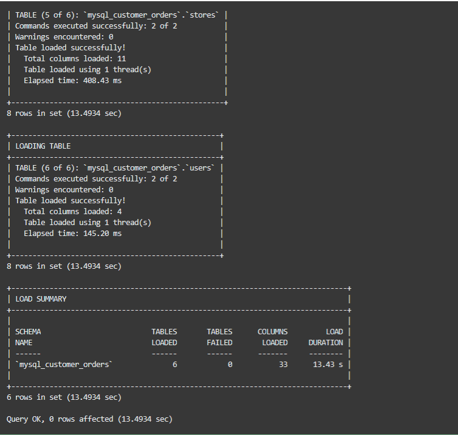

# Load data into HeatWave Cluster

## Introduction

A HeatWave cluster comprise of a MySQL DB System and one or more HeatWave nodes. The MySQL DB System  includes a plugin that is responsible for cluster management, loading data into the HeatWave cluster, query scheduling, and returning query result.

In this lab, you will load data and run queries in the HeatWave Cluster. You will see the query performance improvements on HeatWave compare to MySQL.


_Estimated Time:_ 15 minutes

### Objectives

In this lab, you will be guided through the following task:

- Load mysql\_customer\_orders Data into the HeatWave Cluster
- Run Comparison Queries  with the HeatWave Cluster loaded data

### Prerequisites

- An Oracle Trial or Paid Cloud Account
- Some Experience with MySQL Shell
- Completed Lab 5

## Task 1: Load Schema Data into HeatWave Cluster

1. Login to the OCI Console.
2. Click the Cloud Shell icon in the Console
3. If not already connected with SSH, on Command Line, connect to the Compute instance using SSH ... be sure replace the  "private key file"  and the "new compute instance ip"

     ```bash
    <copy>ssh -i private_key_file opc@new_compute_instance_ip</copy>
     ```

4. Connect to MySQL using the MySQL Shell client tool with the following command:

    ```bash
    <copy>mysqlsh -uadmin -p -h 10.0.1... --sql </copy>
    ```

    

5. Run the following Auto Parallel Load command to load the  mysql\_customer\_orders tables data into the HeatWave Cluster

    ```bash
    <copy>CALL sys.heatwave_load(JSON_ARRAY('mysql_customer_orders'), NULL);</copy>
    ```

6. The completed load cluster screen should look like this:

    

    

- Auto Parallel Load command Result highlights:

    - a. Load analysis box: shows the number of tables/columns being loaded

    - b. Capacity estimation box: showis estimated memory and load time

    - c. Loading table boxes: use different thread to load based on the table

    - d. Load summary box: shows the actual load time

7. Verify that the tables are loaded in the HeatWave cluster. Loaded tables have an AVAIL_RPDGSTABSTATE load status.

    ```bash
    <copy>USE performance_schema;</copy>
    ```

    ```bash
    <copy>SELECT NAME, LOAD_STATUS FROM rpd_tables,rpd_table_id WHERE rpd_tables.ID = rpd_table_id.ID;</copy>
    ```

    

## Task 2: Run Query Comparisons

1. If not already connected then connect to MySQL using the MySQL Shell client tool with the following command:

    ```bash
    <copy>mysqlsh -uadmin -p -h 10.0.1... --sql </copy>
    ```

    

2. Change to the mysql\_customer\_orders database

    Enter the following command at the prompt

    ```bash
    <copy>USE mysql_customer_orders;</copy>
    ```

3. **Query 1** - List Customer total purchase for the year by month

4. Before running a query, use EXPLAIN to verify that the query can be offloaded to the HeatWave cluster. You should see "Use secondary engine RAPID" in the explain plan. For example:

    ```bash
    <copy>EXPLAIN  
    select `o`.`ORDER_ID` AS `order_id`,`o`.`ORDER_DATETIME` AS `ORDER_DATETIME`,
	    `o`.`ORDER_STATUS` AS `order_status`, `c`.`CUSTOMER_ID` AS `customer_id`,
	    `c`.`EMAIL_ADDRESS` AS `email_address`,`c`.`FULL_NAME`  AS `full_name`,
	    sum((`oi`.`QUANTITY` * `oi`.`UNIT_PRICE`)) AS `order_total`,
	    `p`.`PRODUCT_NAME` AS `product_name`,`oi`.`LINE_ITEM_ID` AS `LINE_ITEM_ID`,
	    `oi`.`QUANTITY`  AS `QUANTITY`,`oi`.`UNIT_PRICE` AS `UNIT_PRICE` 
    from (((`orders` `o` join `order_items` `oi` on((`o`.`ORDER_ID` = `oi`.`ORDER_ID`))) 
	    join `customers` `c` on((`o`.`CUSTOMER_ID` = `c`.`CUSTOMER_ID`))) 
	    join `products` `p` on((`oi`.`PRODUCT_ID` = `p`.`PRODUCT_ID`))) 
    group by `o`.`ORDER_ID`,`o`.`ORDER_DATETIME`,`o`.`ORDER_STATUS`,`c`.`CUSTOMER_ID`
	    ,`c`.`EMAIL_ADDRESS` ,`c`.`FULL_NAME`,`p`.`PRODUCT_NAME`
        ,`oi`.`LINE_ITEM_ID`,`oi`.`QUANTITY`,`oi`.`UNIT_PRICE` limit 10;
    </copy>
    ```

    

5. After verifying that the query can be offloaded, run the query and note the execution time. Enter the following command at the prompt:

     ```bash
    <copy> select `o`.`ORDER_ID` AS `order_id`,`o`.`ORDER_DATETIME` AS `ORDER_DATETIME`,
	    `o`.`ORDER_STATUS` AS `order_status`, `c`.`CUSTOMER_ID` AS `customer_id`,
	    `c`.`EMAIL_ADDRESS` AS `email_address`,`c`.`FULL_NAME`  AS `full_name`,
	    sum((`oi`.`QUANTITY` * `oi`.`UNIT_PRICE`)) AS `order_total`,
	    `p`.`PRODUCT_NAME` AS `product_name`,`oi`.`LINE_ITEM_ID` AS `LINE_ITEM_ID`,
	    `oi`.`QUANTITY`  AS `QUANTITY`,`oi`.`UNIT_PRICE` AS `UNIT_PRICE` 
    from (((`orders` `o` join `order_items` `oi` on((`o`.`ORDER_ID` = `oi`.`ORDER_ID`))) 
	    join `customers` `c` on((`o`.`CUSTOMER_ID` = `c`.`CUSTOMER_ID`))) 
	    join `products` `p` on((`oi`.`PRODUCT_ID` = `p`.`PRODUCT_ID`))) 
    group by `o`.`ORDER_ID`,`o`.`ORDER_DATETIME`,`o`.`ORDER_STATUS`,`c`.`CUSTOMER_ID`
	    ,`c`.`EMAIL_ADDRESS` ,`c`.`FULL_NAME`,`p`.`PRODUCT_NAME`
        ,`oi`.`LINE_ITEM_ID`,`oi`.`QUANTITY`,`oi`.`UNIT_PRICE` limit 10;
    </copy>
    ```

    - With HeatWave Cluster **ON: .3509 seconds**

    

6. To compare the HeatWave execution time with MySQL DB System execution time, disable the `use_secondary_engine` variable to see how long it takes to run the same query on the MySQL DB System. For example:

    Enter the following command at the prompt:

     ```bash
    <copy>SET SESSION use_secondary_engine=OFF;</copy>
    ```

7. Enter the following command at the prompt:

     ```bash
    <copy> select `o`.`ORDER_ID` AS `order_id`,`o`.`ORDER_DATETIME` AS `ORDER_DATETIME`,
	    `o`.`ORDER_STATUS` AS `order_status`, `c`.`CUSTOMER_ID` AS `customer_id`,
	    `c`.`EMAIL_ADDRESS` AS `email_address`,`c`.`FULL_NAME`  AS `full_name`,
	    sum((`oi`.`QUANTITY` * `oi`.`UNIT_PRICE`)) AS `order_total`,
	    `p`.`PRODUCT_NAME` AS `product_name`,`oi`.`LINE_ITEM_ID` AS `LINE_ITEM_ID`,
	    `oi`.`QUANTITY`  AS `QUANTITY`,`oi`.`UNIT_PRICE` AS `UNIT_PRICE` 
    from (((`orders` `o` join `order_items` `oi` on((`o`.`ORDER_ID` = `oi`.`ORDER_ID`))) 
	    join `customers` `c` on((`o`.`CUSTOMER_ID` = `c`.`CUSTOMER_ID`))) 
	    join `products` `p` on((`oi`.`PRODUCT_ID` = `p`.`PRODUCT_ID`))) 
    group by `o`.`ORDER_ID`,`o`.`ORDER_DATETIME`,`o`.`ORDER_STATUS`,`c`.`CUSTOMER_ID`
	    ,`c`.`EMAIL_ADDRESS` ,`c`.`FULL_NAME`,`p`.`PRODUCT_NAME`
        ,`oi`.`LINE_ITEM_ID`,`oi`.`QUANTITY`,`oi`.`UNIT_PRICE` limit 10;
    </copy>
    ```

    - With HeatWave Cluster **OFF: 16.4660 seconds**

    

8. Keep HeatWave processing enabled

    ```bash
    <copy>SET SESSION use_secondary_engine=ON;</copy>
    ```

9. Exit MySQL Shell

      ```bash
      <copy>\q</copy>
      ```

You may now **proceed to the next lab**

## Acknowledgements

- **Author** - Perside Foster, MySQL Solution Engineering

- **Contributors** - Abhinav Agarwal, Senior Principal Product Manager, Nick Mader, MySQL Global Channel Enablement & Strategy Manager
- **Last Updated By/Date** - Perside Foster, MySQL Solution Engineering, May 2023
